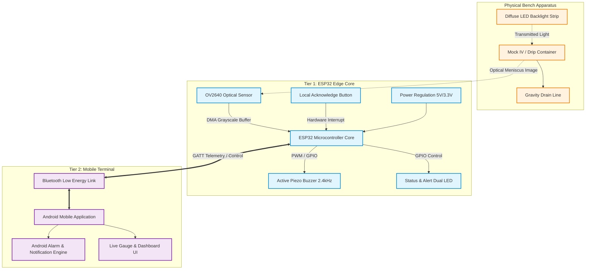
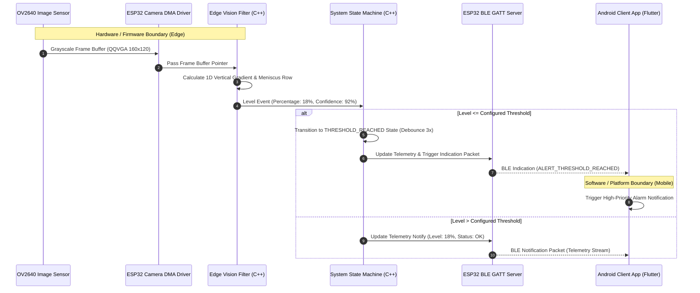
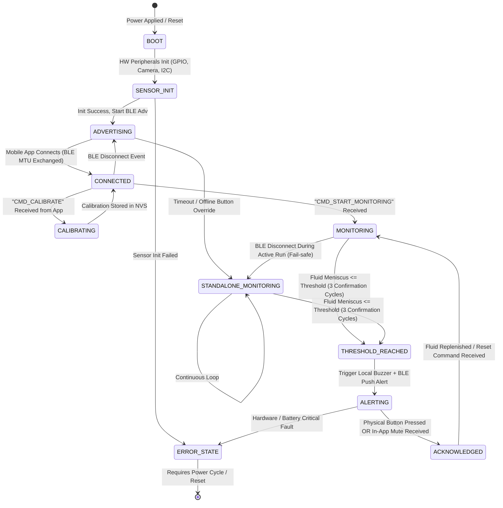
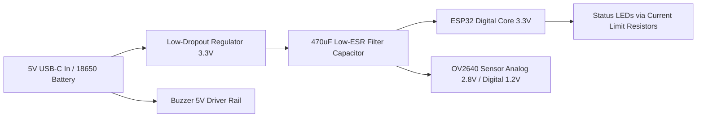

# SYSTEM ARCHITECTURE DOCUMENT

**Project:** SMART-IV MONITOR  
**Document:** 03_SYSTEM_ARCHITECTURE.md  
**Version:** 0.2 (Architecture Baseline)  
**Status:** APPROVED / ENGINEERING SPECIFICATION  
**Last Updated:** 2026-08-15  
**Source of Truth:** Project Systems Engineering Register  

---

## 1. System Overview & Architectural Philosophy

The SMART-IV MONITOR is architected as a **decoupled, two-tier embedded telemetry and notification system**:
1. **Tier 1 (Edge Sensing & Local Alarm Core):** An Espressif ESP32 microcontroller with an optical/vision frontend (ESP32-CAM / OV2640) and dedicated local audio-visual alert transducers (piezo buzzer + dual-color LED). It operates as a fully autonomous state machine capable of monitoring and alarming even if all external network links fail.
2. **Tier 2 (Client Interface & Remote Alarm Terminal):** A companion mobile application running on an Android smartphone connected via Bluetooth Low Energy (BLE 4.2/5.0). It provides the user interface for live fluid visualization, threshold configuration, sensor calibration, and high-priority background alerting.



---

## 2. Evaluation of Sensing Architecture Alternatives

Before finalizing the optical edge architecture, three competing physical transduction modalities were evaluated for the school-level prototype:

| Transduction Modality | Operational Mechanism | Pros | Cons & Risks | Prototype Verdict |
| :--- | :--- | :--- | :--- | :--- |
| **Option A: Optical Vision (ESP32-CAM / OV2640)** | Captures camera image of bottle column; extracts meniscus coordinate via 1D vertical gradient profile $\frac{\partial I}{\partial y}$. | **Non-contact; zero mechanical disturbance to stand; configurable threshold across arbitrary height; highly demonstrative.** | Sensitive to ambient light; requires fixed distance & optical alignment; higher RAM/power draw. | **SELECTED (Primary Prototype):** Uses available ESP32-CAM; enables rich educational demo and edge CV. |
| **Option B: Strain Gauge / Load Cell (HX711 + 1kg/5kg Cantilever)** | Measures total hanging mass ($F_g = m \cdot g$) of container and fluid. | High linearity; immune to ambient light and liquid opacity; direct volume calibration. | Requires mechanical inline hanger; prone to swing oscillations and wire snagging; requires purchasing HX711 + load cell bracket. | **HIGH-PRIORITY BACKUP / BENCHMARK:** Evaluated as secondary standard for ground-truth test plan. |
| **Option C: Discrete IR Transmissive Optocoupler Array** | Fixed vertical ladder of IR emitter/receiver pairs (e.g., TCRT5000 or slotted interrupters) detecting refraction difference. | Very low power; simple GPIO digital reads; immune to ambient daylight. | Fixed discrete spatial resolution (e.g., 25%, 50%, 75%); clumsy mechanical clip; rigid bottle size dependency. | **REJECTED for MVP:** Inferior threshold flexibility compared to continuous vision/weight tracking. |
| **Option D: Ultrasonic Ranging (HC-SR04 / JSN-SR04T)** | Top-mounted ultrasonic transceiver pinging liquid surface. | Continuous level tracking. | Requires opening bottle cap (breaches sterile container assumption); echo reflection from curved walls causes severe noise. | **REJECTED:** Violates non-invasive external boundary rule. |

---

## 3. System Hardware/Software Boundary



---

## 4. End-to-End Operational State Machine

The firmware executes a deterministic finite state machine (FSM) running inside a FreeRTOS task on Core 1 of the ESP32:



### State Definitions & Operational Semantics:
1. `BOOT / SENSOR_INIT`: Initializes GPIOs, FreeRTOS queues, Non-Volatile Storage (NVS), camera clock, and BLE stack. If camera initialization fails, blinks Red LED at $5\text{ Hz}$ and enters `ERROR_STATE`.
2. `ADVERTISING`: Broadcasts BLE advertising packets (`SMART-IV-XXXX`) every $200\text{ ms}$.
3. `CONNECTED`: BLE connection established, services discovered, security handshake completed, ready for commands.
4. `CALIBRATING`: Edge processor samples reference images with bottle full and bottle empty to map pixel row coordinates $[Y_{\min}, Y_{\max}]$ to $[0\%, 100\%]$ range.
5. `MONITORING`: Captures optical frame every $2.0\text{ s}$, extracts meniscus position, computes current percentage, emits BLE telemetry.
6. `STANDALONE_MONITORING`: Failsafe active monitoring when BLE connection is lost or absent.
7. `THRESHOLD_REACHED`: Intermediate confirmation state ensuring level remains below threshold for 3 consecutive reads ($6\text{ s}$ total) to filter transient sloshing.
8. `ALERTING`: Intermittent acoustic buzzer ($1\text{ s}$ ON / $0.5\text{ s}$ OFF) and rapid red LED flashing ($2\text{ Hz}$); continuous BLE high-priority alerts emitted until acknowledged.
9. `ACKNOWLEDGED`: Buzzer silenced, status LED solid Amber/Yellow, waiting for container replacement or user reset.
10. `ERROR_STATE`: Safe halt on unrecoverable hardware fault (camera brownout, low battery $<3.1\text{V}$).

---

## 5. Control, Data, and Failure Flows

### 5.1 Telemetry Data Flow
1. **Acquisition:** OV2640 sensor outputs $160\times 120$ 8-bit grayscale pixel stream via DMA into ESP32 internal SRAM.
2. **Analysis:** C++ gradient kernel processes vertical ROI slice ($120\times 30$ pixels), computing column average $\bar{I}(y)$ and spatial derivative $D(y) = |\bar{I}(y+1) - \bar{I}(y-1)|$.
3. **Peak Detection:** Peak index $y_{\text{peak}}$ located; converted to volume percentage $P = \frac{Y_{\text{empty}} - y_{\text{peak}}}{Y_{\text{empty}} - Y_{\text{full}}} \times 100\%$.
4. **Encoding:** Value packed into 10-byte binary telemetry frame (OpCode `0x10`).
5. **BLE Push:** Transmitted via GATT Notification to mobile app.

### 5.2 Alert Propagation & Fail-Safe Architecture
```
[Physical Fluid Drops Below Threshold]
           │
           ▼
[3-Cycle Confirmation Filter (6 seconds)]
           │
 ┌─────────┴────────────────────────┐
 │                                  │
 ▼ (Local Hardwired Path)           ▼ (Wireless BLE Path)
[Transistor Q1 Switches ON]       [BLE Indication Packet Sent]
 │                                  │
 ▼                                  ▼
[Piezo Buzzer Sounds 75dB]        [Mobile App Receives Packet]
 │                                  │
 ▼                                  ▼
[Red LED Flashes 2Hz]             [Android Alarm Manager Wakes Phone]
                                    │
                                    ▼
                                  [Full-Screen Ringing & Vibration]
```

### 5.3 Communication Loss (Heartbeat Watchdog) Flow
- The mobile app maintains a $5\text{ s}$ rolling countdown timer reset on every incoming telemetry packet.
- If no packet arrives for $6\text{ s}$ ($3\times$ sampling period), the app transitions UI to `WARNING: LINK_INTERRUPTED` and sounds a gentle alert chime reminding the nurse of potential wireless coverage loss.
- Meanwhile, the ESP32 automatically switches to `STANDALONE_MONITORING`, ensuring bedside local alarm protection is never disabled.

---

## 6. Power Architecture & Distribution



- **Brownout Suppression:** A $470\,\mu\text{F}$ electrolytic capacitor in parallel with a $100\text{ nF}$ ceramic capacitor is situated directly adjacent to the ESP32 VDD/GND pins to supply transient currents during camera clock startup and BLE radio TX bursts.
- **Power Budget:**
  - Active capture phase ($80\text{ ms}$): $140\text{ mA} @ 3.3\text{V} \approx 462\text{ mW}$
  - BLE transmit phase ($15\text{ ms}$): $120\text{ mA} @ 3.3\text{V} \approx 396\text{ mW}$
  - Idle sleep phase between cycles ($1905\text{ ms}$): $35\text{ mA} @ 3.3\text{V} \approx 115\text{ mW}$
  - **Weighted Average Power:** $\approx 145\text{ mW}$ ($44\text{ mA}$ average at $3.3\text{V}$).
  - **Estimated Run Time on $2000\text{ mAh}$ Li-ion Cell:** $\sim 35\text{ to }40\text{ hours}$ continuous operation.

---

## 7. Security and Safety Boundaries

1. **BLE Radio Access Control:** The prototype uses an open advertising profile with 4-digit PIN pairing / Just Works bonding for ease of school demonstration. In clinical environments, AES-128 LE Secure Connections would be required (marked as FUTURE in PRD).
2. **Input Sanitization:** All incoming BLE Write commands (threshold percentage, calibration coordinates) are bounded and strictly validated against range $[0, 100]$ to prevent buffer overflow or corrupted state transitions.
3. **Strict Physical Non-Interference:** The entire apparatus is physically isolated from the sterile IV fluid set by a minimum air gap of $\ge 50\text{ mm}$ and encased in a non-conductive enclosure.
