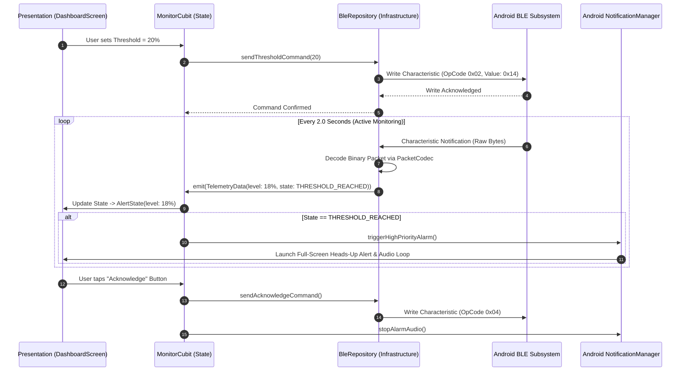

# SOFTWARE ARCHITECTURE DOCUMENT

**Project:** SMART-IV MONITOR  
**Document:** 05_SOFTWARE_ARCHITECTURE.md  
**Version:** 0.2 (Software Baseline)  
**Status:** APPROVED / ENGINEERING SPECIFICATION  
**Last Updated:** 2026-08-15  
**Source of Truth:** Project Systems Engineering Register  

---

## 1. Mobile Technology Evaluation & Selection

To select the most robust software stack for the companion mobile terminal, three platforms were evaluated against project criteria (BLE responsiveness, low-cost Android target support, background notification reliability, and development velocity):

| Technology Stack | BLE & OS Integration | Development Speed | Background Notification Capabilities | Verdict |
| :--- | :--- | :--- | :--- | :--- |
| **Flutter (Dart) + `flutter_blue_plus`** | High (cross-platform plugin with direct Android BLE callbacks). | Very High (single codebase, rapid declarative UI iteration). | Strong via `flutter_local_notifications` and Android Foreground Service bindings. | **SELECTED:** Provides rapid cross-platform deployment, clean state management (Bloc/Provider), and rich animated gauges. |
| **Native Android (Kotlin + Jetpack Compose)** | Native (direct access to `BluetoothGatt`, zero plugin abstraction overhead). | High (modern Kotlin Compose). | Native (deepest integration with Android AlarmManager, WakeLocks, and Notification Channels). | **PRIMARY NATIVE ALTERNATIVE:** Documented as drop-in equivalent for Android-exclusive setups. |
| **React Native (TypeScript)** | Medium (relies on third-party BLE bridges which often face thread lock issues). | Medium (requires bridging native modules). | Moderate (background threading requires complex headless tasks). | **REJECTED:** Higher friction and bridge overhead for real-time BLE telemetry. |

---

## 2. Layered Software Architecture (Clean Architecture Pattern)

The mobile codebase is structured according to Clean Architecture principles to enforce separation of concerns, testability, and decoupling of the Bluetooth hardware layer from presentation components.

```
mobile_app/
│
├── lib/
│   ├── presentation/           # UI Layer (Screens, Widgets, State Consumers)
│   │   ├── screens/
│   │   │   ├── scan_screen.dart          # BLE Discovery & Device Picker
│   │   │   ├── dashboard_screen.dart     # Live Fluid Gauge, Status & Controls
│   │   │   ├── calibration_screen.dart   # Interactive Zero/Full Wizard
│   │   │   └── alert_dialog_screen.dart  # Full-Screen Alarm Modal
│   │   ├── widgets/
│   │   │   ├── fluid_bottle_gauge.dart   # Custom Canvas Animated Liquid Meter
│   │   │   ├── threshold_slider.dart     # Custom Range Slider with Markers
│   │   │   └── connection_badge.dart     # RSSI & Heartbeat Indicator
│   │   └── state/
│   │       ├── monitor_cubit.dart        # Core Application State Manager
│   │       └── monitor_state.dart        # Immutable UI States (Loading, Connected, Alert)
│   │
│   ├── application/            # Application Services & Orchestration
│   │   ├── monitor_service.dart          # Coordinates Telemetry & Alarm Rules
│   │   ├── threshold_manager.dart        # Validates and Synchronizes Thresholds
│   │   └── notification_engine.dart      # Manages Android Alarm Channels & Audio
│   │
│   ├── domain/                 # Pure Business Logic & Domain Models
│   │   ├── entities/
│   │   │   ├── iv_device.dart            # Device Name, MAC, RSSI
│   │   │   ├── telemetry_data.dart       # Level (%), Battery (mV), State Enum
│   │   │   └── calibration_profile.dart  # Y_min, Y_max, Threshold_px
│   │   └── repositories/
│   │       └── i_ble_repository.dart     # Abstract BLE Interface Contract
│   │
│   └── infrastructure/         # External Hardware, OS, & Storage Drivers
│       ├── ble/
│       │   ├── ble_scanner.dart          # Advert Filtering (SMART-IV-*)
│       │   ├── ble_connection_manager.dart # GATT Lifecycle, MTU, Auto-reconnect
│       │   └── packet_codec.dart         # Binary Byte Serializer / Deserializer
│       ├── storage/
│       │   └── local_preferences.dart    # Persists Calibration & Paired MAC
│       └── notifications/
│           └── android_alarm_service.dart # Native Foreground Service & Ringtone Player
```

---

## 3. Component Interaction & State Flow



---

## 4. Mobile State Modeling

The `MonitorCubit` manages the following immutable state hierarchy:

```dart
// Immutable State Hierarchy
sealed class MonitorState {}

class MonitorDisconnected extends MonitorState {}

class MonitorScanning extends MonitorState {
  final List<IvDevice> discoveredDevices;
  MonitorScanning(this.discoveredDevices);
}

class MonitorConnecting extends MonitorState {
  final IvDevice targetDevice;
  MonitorConnecting(this.targetDevice);
}

class MonitorConnected extends MonitorState {
  final IvDevice device;
  final TelemetryData telemetry;
  final int thresholdPercent;
  final bool isLinkHealthy;
  MonitorConnected({
    required this.device,
    required this.telemetry,
    required this.thresholdPercent,
    this.isLinkHealthy = true,
  });
}

class MonitorAlerting extends MonitorState {
  final IvDevice device;
  final TelemetryData telemetry;
  final int thresholdPercent;
  final DateTime alertTimestamp;
  MonitorAlerting({
    required this.device,
    required this.telemetry,
    required this.thresholdPercent,
    required this.alertTimestamp,
  });
}

class MonitorError extends MonitorState {
  final String errorMessage;
  final int errorCode;
  MonitorError(this.errorMessage, this.errorCode);
}
```

---

## 5. Android OS Permissions & Background Execution Architecture

### 5.1 Android Permission Manifest Requirements (API Level 31+ / Android 12+)
To discover and maintain a reliable BLE link, the `AndroidManifest.xml` must declare:
```xml
<!-- Android 12+ Fine-Grained BLE Permissions -->
<uses-permission android:name="android.permission.BLUETOOTH_SCAN" 
    android:usesPermissionFlags="neverForLocation" />
<uses-permission android:name="android.permission.BLUETOOTH_CONNECT" />

<!-- Legacy Location required for BLE scanning on Android 6.0 to 11.0 -->
<uses-permission android:name="android.permission.ACCESS_FINE_LOCATION" 
    android:maxSdkVersion="30" />

<!-- Foreground Service & High Priority Notifications -->
<uses-permission android:name="android.permission.POST_NOTIFICATIONS" />
<uses-permission android:name="android.permission.FOREGROUND_SERVICE" />
<uses-permission android:name="android.permission.FOREGROUND_SERVICE_CONNECTED_DEVICE" />
<uses-permission android:name="android.permission.WAKE_LOCK" />
<uses-permission android:name="android.permission.VIBRATE" />
```

### 5.2 Android Alarm Channel & Audio Ringing Strategy
1. **Foreground Service:** When active monitoring commences, the app launches an Android Foreground Service with a sticky notification displaying live level percentage. This prevents Android Doze mode or aggressive battery cleaners from killing the BLE connection.
2. **High-Importance Notification Channel:**
   - Channel ID: `smart_iv_critical_alerts`
   - Importance: `Importance.max` / `Priority.high`
   - Sound: Set to custom looping emergency chime (`res/raw/alarm_chime.wav`).
   - Category: `NotificationCompat.CATEGORY_ALARM` (allows bypassing Do Not Disturb when explicitly allowed by the caregiver).
   - Audio Focus: Requests transient exclusive audio focus to guarantee alarm sound audibility over background media.

---

## 6. Binary Packet Codec Architecture

To prevent CPU overhead and memory allocations associated with string parsing or JSON deserialization on the ESP32 microcontroller, all BLE exchanges use a fixed-width binary encoding:

```
Telemetry Packet Layout (10 Bytes Total):
┌──────────┬──────────┬──────────┬──────────┬──────────┬──────────┬──────────┐
│ OpCode   │ SeqID    │ Level %  │ State    │ Batt_MSB │ Batt_LSB │ CRC-8    │
│ (1 Byte) │ (1 Byte) │ (1 Byte) │ (1 Byte) │ (1 Byte) │ (1 Byte) │ (1 Byte) │
│  0x10    │ 0x00..FF │  0..100  │ Flags    │ Voltage in Millivolts │ Checksum │
└──────────┴──────────┴──────────┴──────────┴──────────┴──────────┴──────────┘
```

The Dart `PacketCodec` decodes incoming `Uint8List` streams using byte-shifting operations and calculates a CRC-8-CCITT lookup table to immediately discard corrupted RF frames.

---

## 7. Fault Tolerance & Offline Recovery

1. **Auto-Reconnect Loop:** If the BLE link drops (`BluetoothConnectionState.disconnected`), the `BleConnectionManager` initiates an exponential backoff reconnect attempt (retrying at $1\text{ s}$, $2\text{ s}$, $4\text{ s}$, max $10\text{ s}$).
2. **Heartbeat Watchdog:** If 3 consecutive expected packets ($6\text{ s}$) are missed, the UI transitions to a yellow alert state `LINK_WARNING` and logs the timestamp.
3. **Local Cache Fallback:** All user-configured thresholds and calibration parameters are persisted in local flash storage so that upon reconnect, the app immediately re-synchronizes the ESP32 state without requiring manual re-calibration.
